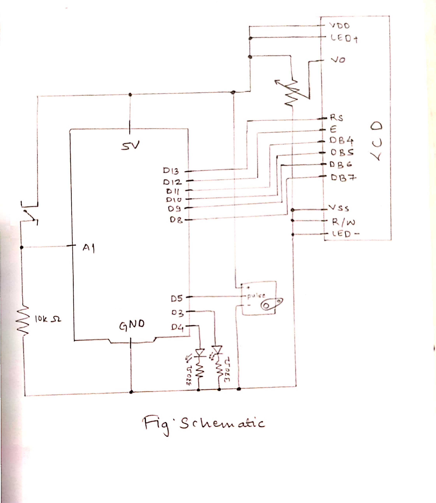
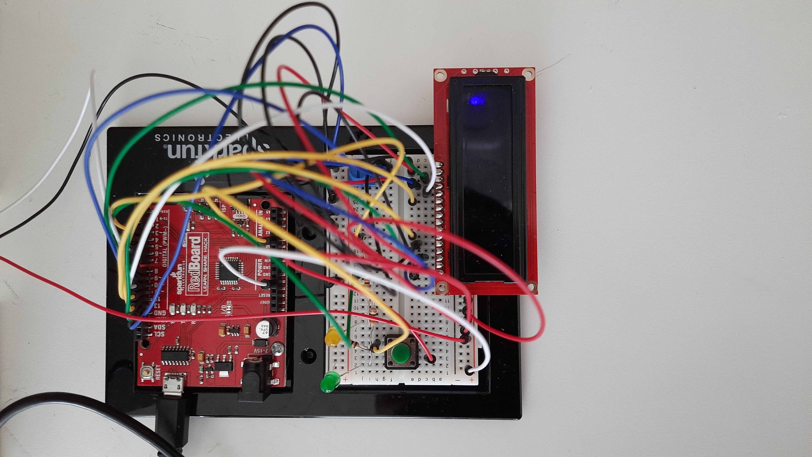
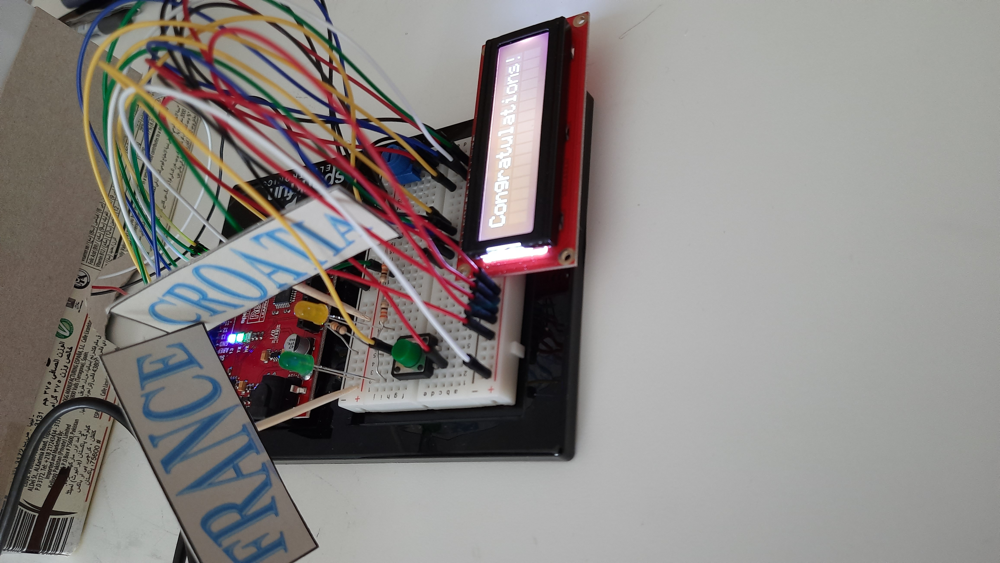
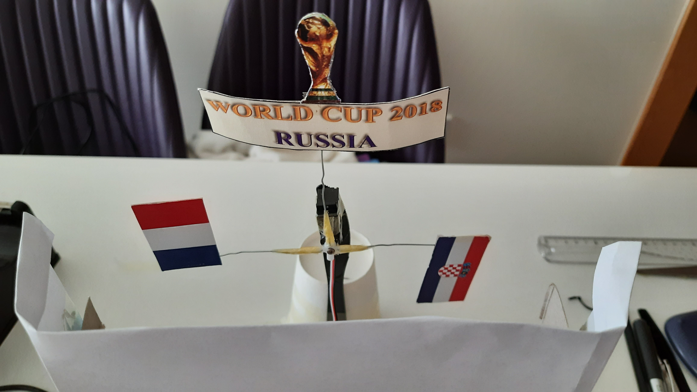
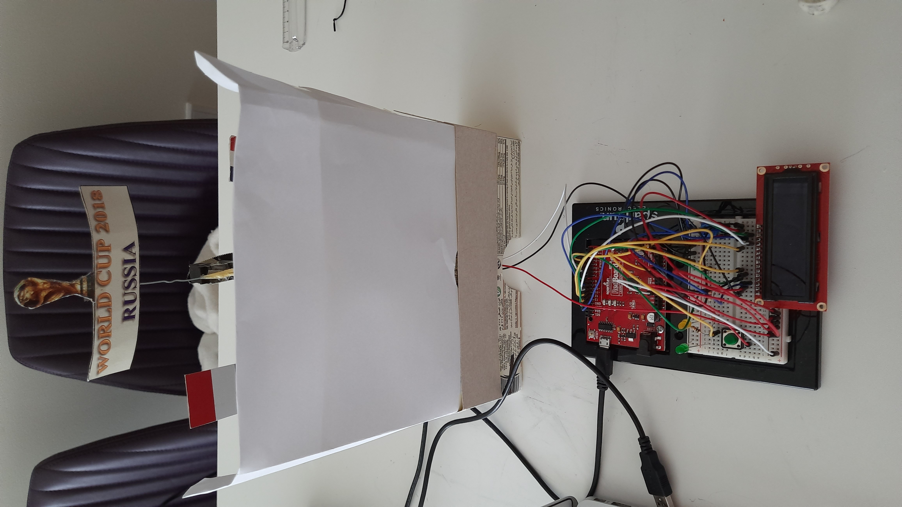
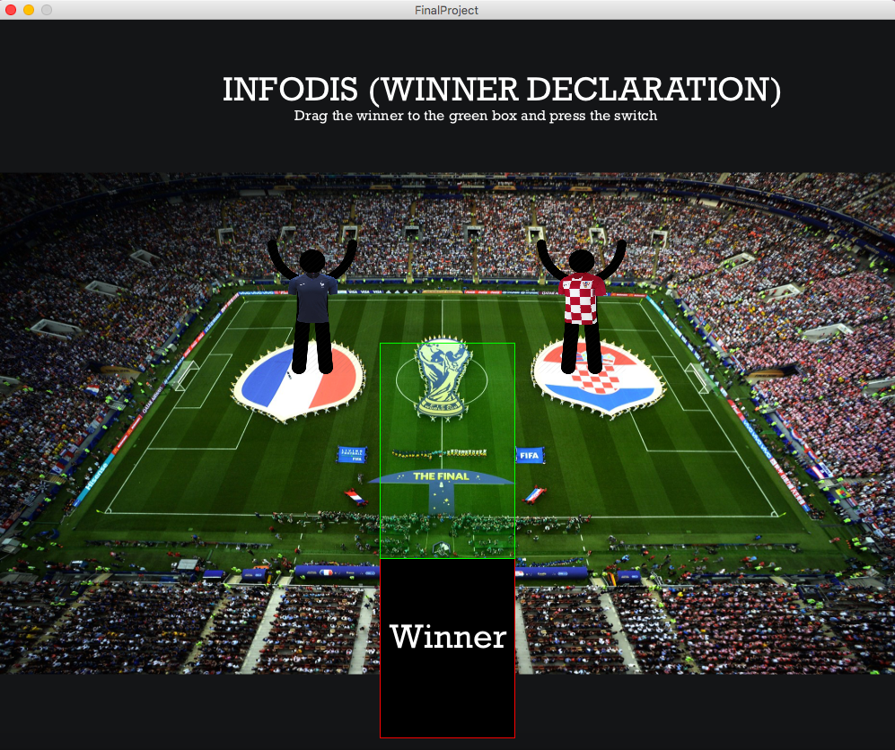

## FINAL PROJECT

INFODIS (WINNER DECLARATION)

### CONCEPT

INFODIS stands for Information Dissemination. The concept of this project is to create a system that can be used for the winner declaration in any two player of two team games. For the demo of this project, I chose to perform the winner declaration of FIFA World Cup 2018.

What happens in this project is that the user is displayed a screen through Processing with a box for the winner position and two symbolics, one for each of the two players/ teams of the game. The user has to drag the symbol for the winning player/team into the box and press the switch on the breadboard and the program will do the following things:
  - Raise the respective flag or symbol of the winner (using servo motor)
  - Light up the LED below the name board of the winner
  - Display the winner name below the "Congratulations!" message on the LCD
  - Also, play the theme tune of the game when the winner is announced
  
For my project, since I chose to do the FIFA World Cup, the two teams are the finalist countries: France and Croatia. I have used their flags as their symbols on the servo motor and their jerseys as their symbols on the screen. Whenever the winner France's symbol is dragged to the winner box, its flag is raised, the LED below its name is lit up and the LCD displays "Congratulations! France" while playing the official theme tune of FIFA World Cup 2018. All of these happen for 12 seconds and then go back to normal.

### IMAGES

#### PICTURE OF SCHEMATIC

#### PICTURE OF CIRCUIT

#### PICTURE OF SERO MOTOR WITH FLAGS

#### FULL PICTURE OF PROJECT

#### PROCESSING INTERFACE

[VIDEO](https://github.com/ym1929/Introduction-to-Interactive-Media/blob/master/FinalProject/final_Video.mp4)

### CHALLENGES

My initial idea was to imitate the winner announcement ceremony of the Olympics games. For that I needed a motor that would rotate 360 degrees as I needed 3 flags for the three position holders. However, the servo motor that we have rotates only 180 degrees and due to that I could not go according to my plan. Then, I had to struggle with deciding how to take my project forward and how to modify it. Finally I decided to make my own kind of winner announcing program that could be used for any general two player or two team games. 

Moreover, I was planning to use the buzzer as well in my project. But due to the lack of jumper wires, I switched to using sound from Processing. I was also having trouble using the sound library in Processing as it was giving me broken sounds. So, I used the minim library of Processing instead. I knew it would work because I had used it for another class earlier. The only thing that took me a while to figure out was how to use it with Java because I had used it with Python the previous time. It wasn't that difficult however. 

The next thing that was challenging for me was to figure out how to use the LCD. The number of connections it required left me confused about how to use it. Also, some wires being loose in connection caused it to display only rectangles on its screen instead of the text that I wanted. Figuring out how to fix it took up a lot of time but I finally fixed it and made it to work.

I also felt that the code for dragging an object to another position on screen was a bit difficult for me to figure out because it did not move as I wanted and I spent alot of time trying to fix that. Ultimately, using boolean variables to decide whether the user has clicked on the right position or not, helped me get to the code that could enable me to drag objects as I wanted.

Finally, controlling the servo motors and the LCD and the LEDs all interconnected to each other was quite challenging for me, especially because I could not use delay() functions to get them to work in the speed that I wanted. I had to figure out a way to control each one of them without the delay() function which was the most challenging part for me.

### REFLECTION

The project did not turn out as I had planned. However, I had a good time preparing this project. There were a lot of things that I thought would be simple, but turned out to be alot complicated than I thought and consumed a lot of my time in debugging. It was a good experience trying out new things and new combinations. But also it was a bit disappointing that some things could not be the way I wanted them to be, some because of laack of materials and some because of lack of time and also some because of lack of idea. Nonetheless, the overall experiance was that I learnt a lot from this project and it also helped me better my debugging skills.
