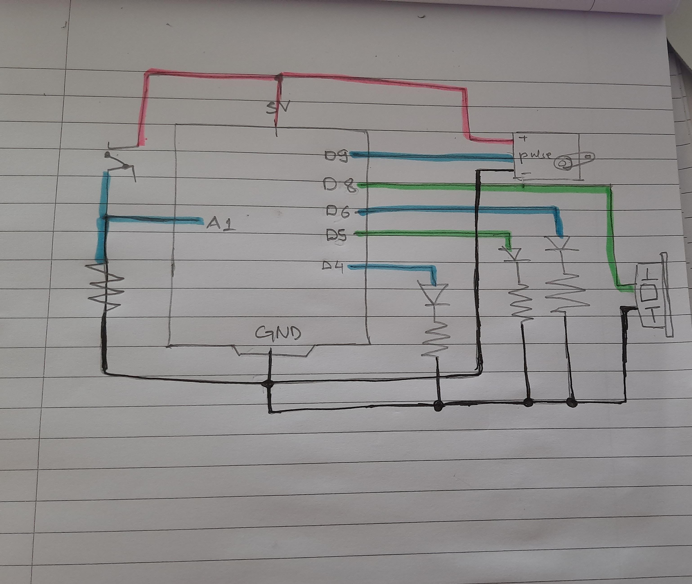

### SCHEMATIC

### Description of what my Arduino program will do with each input and output 

 - For input, I will have a switch that will signify that the announcement of the position holder has been done when pressed. 
 - For output, I will have the following:
  - A servo motor that will have the flags attached to it. My Arduino program will make it rotate in a certain angle according to which flag is required (which country is announced)
  - 3 LEDs, each associated with each of the three position holders. My Arduino program will make it light up when that particular announcement is made
  - A buzzer, which will play the specific tune when the position holder is announced

### Description of what it will send to and/or receive from Processing

Arduino will mostly receive signal/ information from Processing about which country is being announced currently, according to which Arduino will make each output device do their specific tasks.

The only time when Arduino will send a signal to processing is when the switch is pressed so that Processing can send the required information to Arduino to perform the required next steps.

### Description of what Processing program will do and what it will send to and/or receive from Arduino

The Processing program will display a screen where the user will assign one of the three chosen countries to one of the positions, i.e. make the announcement of the winners. Then, when the switch is pressed, Processing will receive a signal that Arduino now requires the information of which country and which position it is. After that Processing will send the required information to Arduino to allow it to do the next steps i.e. raise corrsponding flag, light the LED and play the sound.

Note: For now I have only used the LED, buzzer and the motor. I might add the LCD display if I can make everything else work before time.
