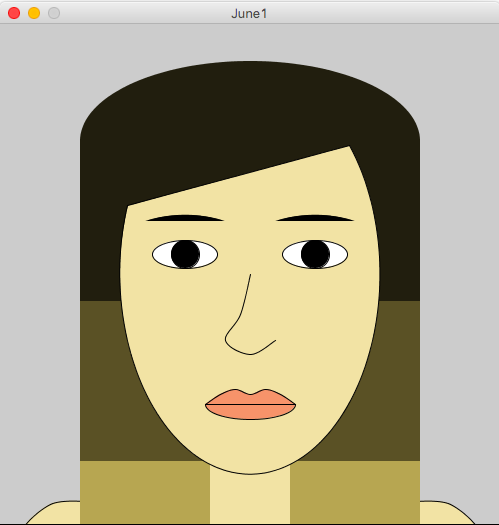

## JUNE 1 ASSIGNMENT

In this assignment, I made a self portrait using Processing, which was a cool way to explore different shapes and functions in Processing. It enabled me to understand how they worked and I enjoyed doing it.

It was quite difficult and time consuming for me to get the exact coordinates in the window for placing the shapes in right positions to make it look like my self-portrait. However, using some variables and some mathematical calculations enabled me to place all the elements in right places and get the final piece as I desired. 

Also, from the Reference page of Processing, I found out about the function curveVertex() and it was fun to play around with it to create my own shapes for the nose and lips. Initially, I was confused about how the function worked. But after playing around with it for a while I figured it out and was able to use it in my portrait.
