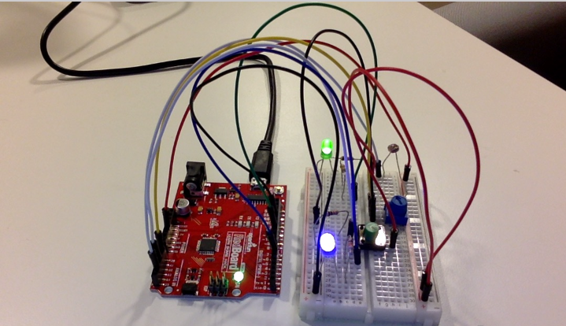
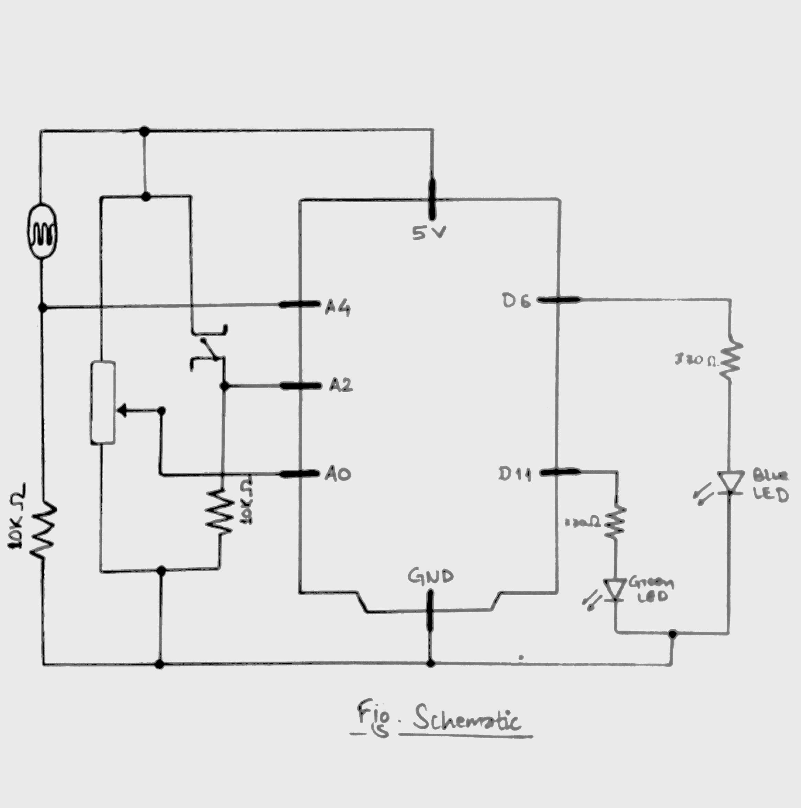

## JUNE 16 ASSIGNMENT

ARDUINO IO

#### CONCEPT

The task in this assignment was to get information from at least one analog sensor and at least one digital sensor (switch), and use this information to control at least two LEDs, one in a digital fashion and the other in an analog fashion, in some creative way. In my project, what I did is as follows:

If the switch is pressed, the two LEDs start to blink alternaely. The input is taken from the light sensor to vary the alternating speed between two LEDs. The speed gets slower when there is less light and increases as the amount of lights it is exposed to increaseas. The speed varies from 5 seconds (when no light is sensed) to 0.1 seconds (when maximum light is sensed).

If switch is not pressed, both the LEDs light up but their brightness are determined according to the analog input in the potentiometer. The green LED has maximum brightness when the potentiometer sends maximum input and the blue one has maximum brightness when the potentiometer sends minimum input. This is because in the program, the brightness of the green LED is set as the reading in potentiometer and the brightness of the blue LED is set as maximum brightness minus the reading in potentiometer. So, as the knob of the potentiometer is turned, one LED has its brightness increasing and the other has it decreasing. 

#### IMAGES

##### Photograph of Project

##### Picture of Schematic

[Video]()

#### CHALLENGES

Setting up the circuit was quite a challenge for me as it is my first time working with circuits. I was confused about which wire connects where and hence, I had to refer a lot to the works we did in the class and the lecture notes to get the circuit right. 

#### REFLECTION

It was a good practice for me to work with building basic circuits and understanding them. I got an opportunity to try out different patterns of lighting the LEDs based on analog inputs from the light sensor and potentiometer, and digital input from the button, before finalising on one pattern. It was an enjoyable assignment for me.
