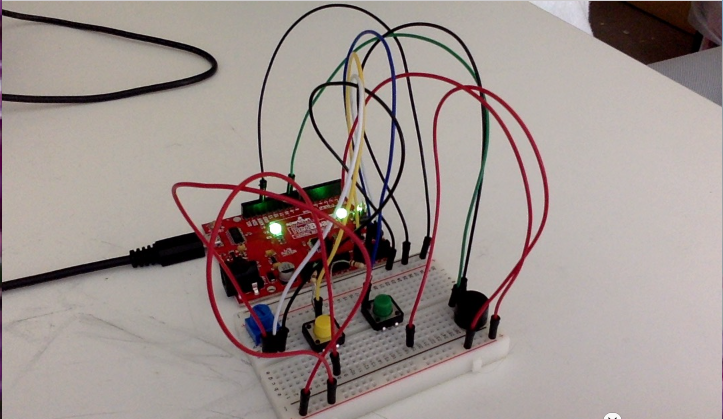
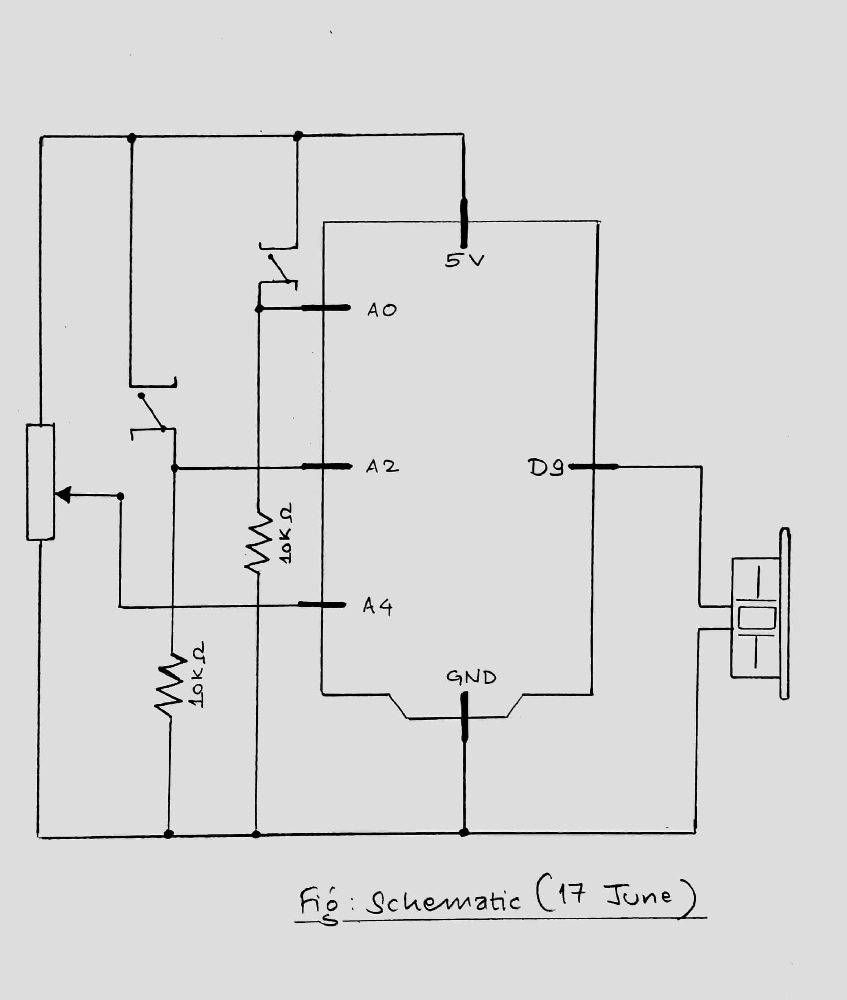

## JUNE 17 ASSIGNMENT

MUSICAL INSTRUMENT

### CONCEPT

The task in this assignment was to make a musical instrument using at least one digital sensor (switch) and at least one analog sensor (photoresistor, potentiometer, or distance measuring sensor). The project that I created is an instrument that plays the rhythm of 'Twinkle Twinkle Little Star' whenever the button is pressed. I have used two buttons (green and yellow). The yellow button plays the rhythm in a loop as long as the button is pressed. The green button plays the notes of the rhythm in reverse in a loop as long as the button is pressed. I have used the potentiometer as the analog sensor (input). The potentiometer here is used to determine the tempo of the rhythm i.e. how fast the rhythm is played.

### IMAGES

#### PHOTO OF PROJECT

#### PICTURE OF SCHEMATIC 

[Video]()

### CHALLENGES

The main challenge for me was to create the circuit with the digital sensor, analog sensor as well as the speaker. It took me a while to figure out proper connections for all the components I was using. Moreover, the bigger challenge was the code where I tried to avoid using the delay() function and tried to use different variables and conditionals (like we learnt in class) to produce sound at appropriate times. However, after I changed the code, it started playing the notes in a way that was different than expected. It happened because I placed certain parts of the code in wrong the place. It took me a lot of trial and error to make it finally work as I wanted. Also, I tried to avoid looping while playing the rhythm; I wanted the rhythm to play only once when the button is pressed and then stop playing when the full rhythm is played. However, for some reason, when I did that, it would not play any sound even when the button is released and pressed again. I tried hard to figure out what was happening, but I still am unable to figure it out. So, I enabled the looping for now.

### REFLECTION

It was a good practice playing with the speaker and switches and the potentiometer together. I wanted use the servo motor as well in some way but I did not have enough time to come up with any idea for that as it took me a long time to complete what I have right now. The loosening of wires and creating interruptions was very annoying. Nonetheless, I am glad that I could complete the project in time. 
