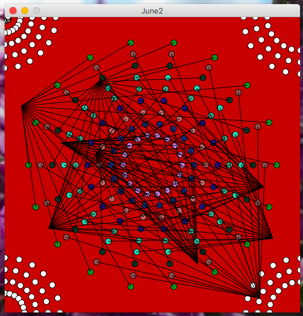
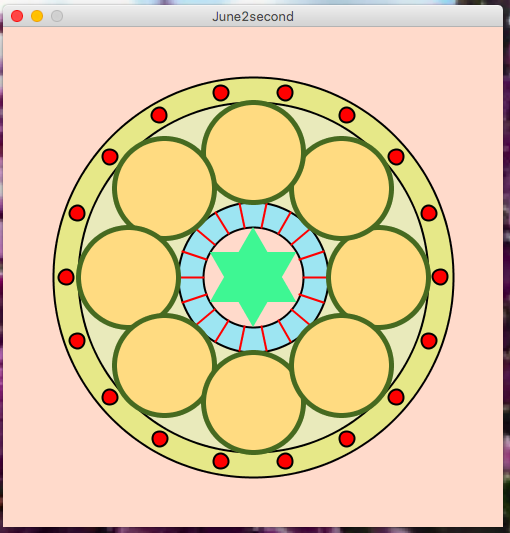

## JUNE 2 ASSIGNMENT

In this assignment, I was supposed to make a simple work of art using Processing. I have tried to create two different types of artworks using for loops and some basic shape functions of Processing. Both my artworks are of dynamic type but are different from each other.

The first one is where it starts with a blank screen and forms the artwork as we look at it and later becomes still after it is complete. The screenshot is attached below:

The second artwork that I have tried is inspired from Mandala art designs. In this piece, the artwork is already formed when the program is run but it keeps rotating until the program is stopped. There is no movement across the screen in this piece, but only rotation within itself. The screenshot is attached below:

### Challenges
It took me quite some time to come up with a design that looked good to my eyes. Then, I had a difficult time with determining the coordinates for the elements in my art piece, as in the previous assignment. Also, I had to do alot of trial and error in order to figure out the right way to make my second artpiece rotating. It was an effect that I thought would look cool on my art piece by giving it some dynamic touch.

### Reflection
Overall, this assignment gave more opportunity to apply the concepts learned in class inclusing dynamic programs, loops, conditionals and basic shape functions in Processing. I even tried out the sin() and cos() functions that allowed me to create the rotating effect as well as some other designs in both the works of art that I made for this assignment. It was an assignemnt that I enjoyed doing, although the debugging part was a bit troublesome. 
