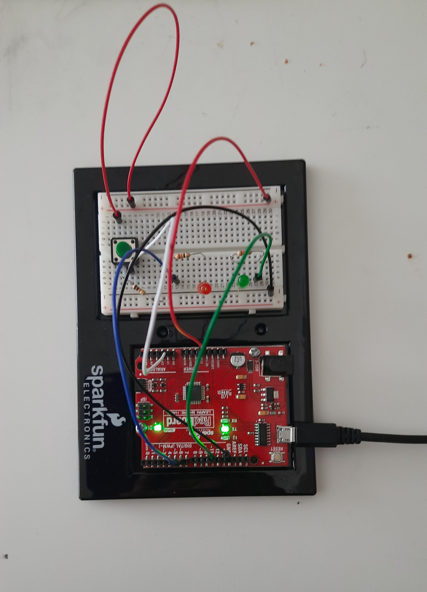
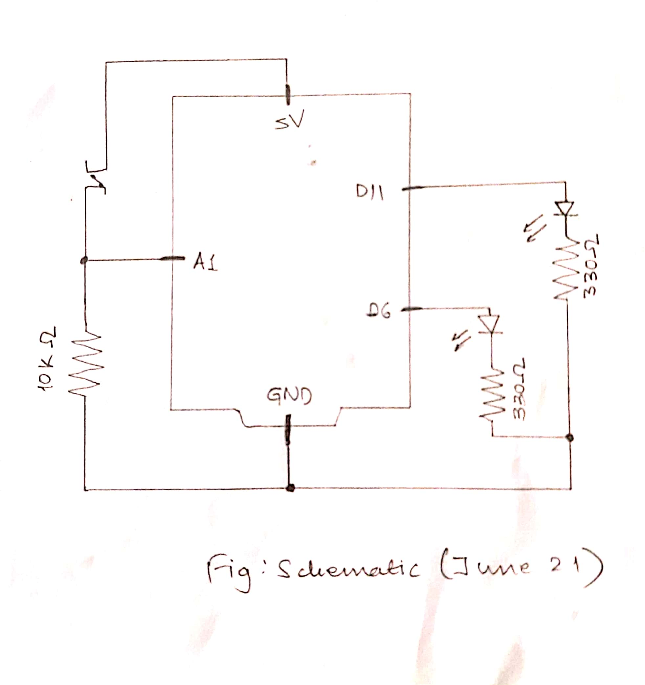
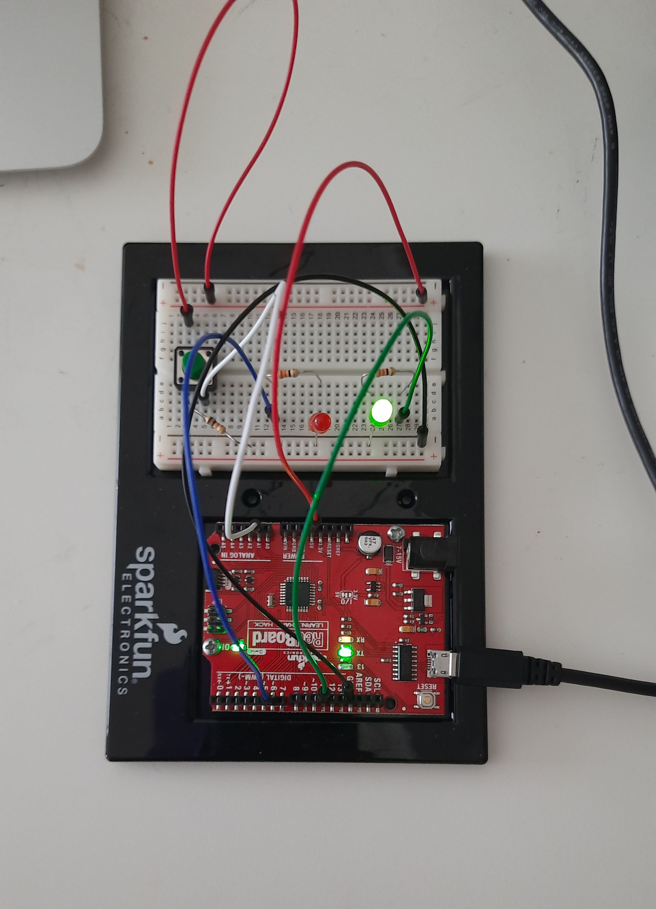
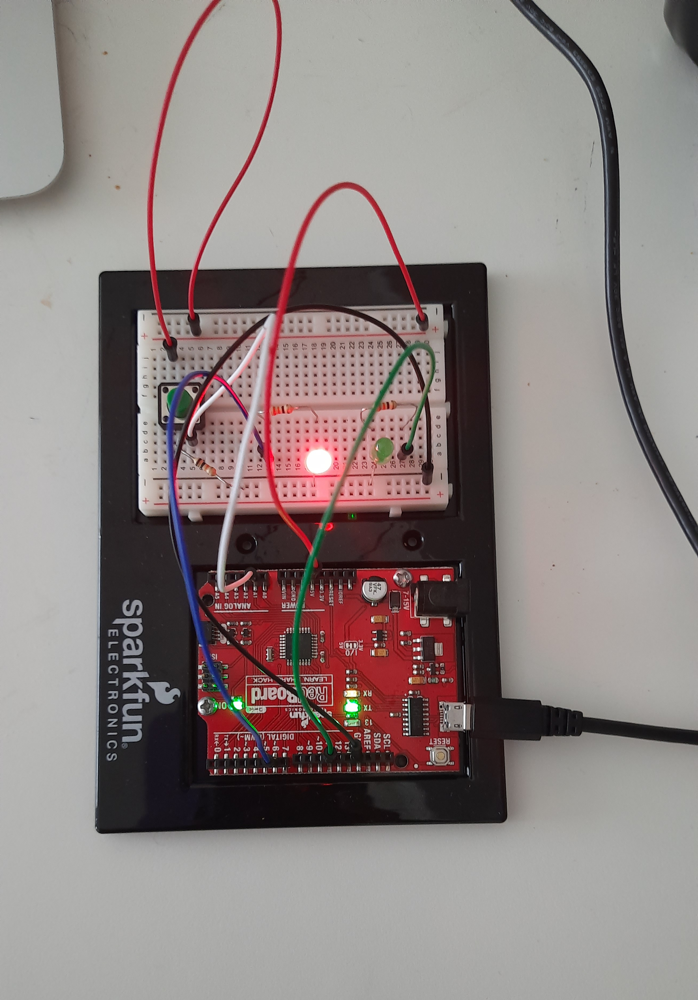

## JUNE 21 ASSIGNMENT

COMMUNICATION

The task in this assignment was to make a simple game that involves some kind of communication between Arduino and Processing.

### CONCEPT

* There is a basket moving to and fro from left to right.
* There are 10 objects on the top of the screen that appear one by one
* When the switch is pressed, the items are dropped
* The goal is to drop the items such that they fall into the basket
* The score is the number of items collected in the basket
* The green LED is turned on when the item is successfully collected
* The red LED is turned on when the item is missed

#### Communication used
* Processing receives the signal from Arduino when the switch is pressed.
* Processing sends signal to Arduino when it is time to:
  * turn on the green LED
  * turn on the red LED
  * turn off both LEDs
  
### IMAGES

#### Picture of Circuit

#### Picture of Schematic

#### Beginning of game

#### Green LED on catching item

#### Red LED on missing item

#### Ending of game

[Video]()

### CHALLENGES

The challenging part of this assignment, I think, was to understand the communication between Arduino and Processing and use it in my project. I had to look at a couple of examples to understand how it worked. Although I could easily send signals from Arduino to Processing, I was constantly having problem with sending signal from Processing to Arduino. I initially sent the signal to turn on the LED only and tried to turn it off from Arduino itself, but the Serial.read() function kept reading the same line again and again and made the LED blink instead of turning it on only once. This messed up the LED lighting that I had planned. However, I understood the problem and then decided to send another signal as well to turn the LED off and it solved the problem. I kept this project a bit simpler so there were no other major challenges in completing this assignment.

### REFLECTION

It was a good practice to understand how Processing and Arduino communicate with each other. I enjoyed completing this assignment as I got to learn new things about Processing and Arduino working together and also got an opportunity to practice and try it out myself before the final project.
