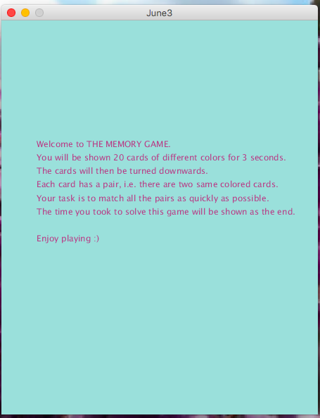
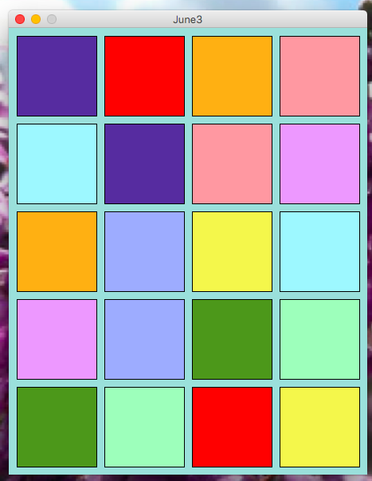
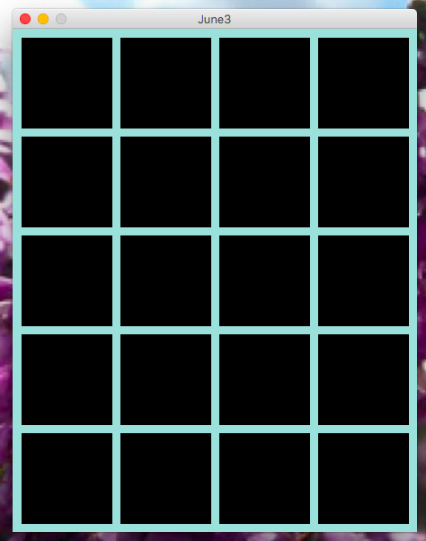
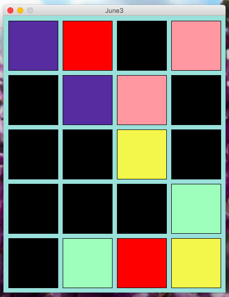
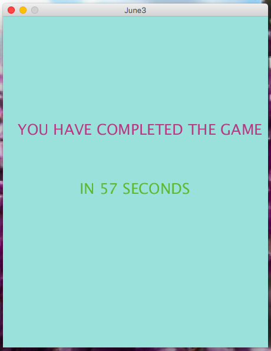

## JUNE 3 ASSIGNMENT

In this assignment, I was supposed to create an artwork or a game using Object Oriented Programming in Processing. I chose to create a game. I call this game "The Memory Game. It is a card game in which all the cards are laid face down. Two cards are flipped face up over at a time by the player.The objective of the game is to turn over all the pairs of matching cards in as less time as possible. The screenshots for the game are attached below:

#### BEGINNING INSTRUCTIONS

#### INITIAL DISPLAY OF CARDS FACED UP (allowing player to memorize)

#### ALL CARDS FACED DOWN

#### GAME IN PROGRESS

#### END OF GAME

### CHALLENGES

The process of making this game overnight was quite challenging for me. I had made games in Processing a few times for my past classes. However they were all over a span of 1-2 weeks. Having to plan, code and debug an entire game overnight was something I felt was quite difficult for me. Nonethelss, I was able to complete it on time. The main difficulty was planning how to design the game, which functions to use, and what attributes to assign to each class used in the game. I struggled with the variable mousePressed and the function mouseClicked() while trying to make my game work. I was extremely confused in how these two were different and how the use of each was affecting my code. Ultimately, after reading about these on Processing reference page and some trial and error, I figured out that the function was the key to making my game work properly rather than the variable. It also took me some time to figure out how to shuffle the cards and display the right card when clicked by the user. After a lot of brainstorming, I found my way to completing this assignment.

Some new concepts that I used in this assignment are 2D lists for storing the rgb values for each pair of cards. Also I used the text function of Processing for the Instruction page and the message at the end of the game. I have also use IntList(), which is more or less similar to an array but has different attributes and methods that made my work easier. I came across it when I was trying to find ways to shuffle my cards efficiently. I used IntList() because it had an in-built shuffle() method.

### REFLECTION

Overall, this assignment was a challenging one but also it exposed me to new concepts and I enjoyed doing it as I explored new things.
