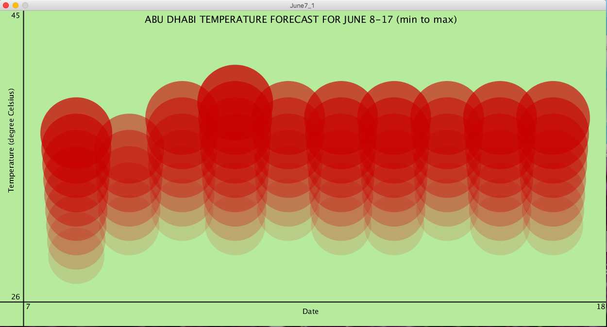

## June 7 Assignment

### Part 1:

In part 1 of today's assignment, I was supposed to create either a data visualization or a generative text. I chose to create a data visualization. I used the data from 
[weather.com](https://weather.com/weather/tenday/l/0755f9b1a0f85388ca0d9510010eed3e6274c95ec9ecc1a8353af4782d304238) 
for the daily maximum and minimum temperature forecasts in Abu Dhabi between 8 and 17 June (10 days). I created a csv file by myself using the data (10 lines for 10 days, each line contained 3 elements: date, minimum temperature, maximum temperature). For the visualization, I set my horizontal axis as the dates and my vertical axis as the temperatures in degree celsius. Then, I generated circles of width scaled according to the respective temperatures. I drew circles for the temperatures ranging from the minimum to the maximum for each of the 10 dates and also scaled the transparency of the circles according to the temperatures. The output looked as follows:

Screenshot of the data:

#### CHALLENGES
In this assignment I struggled for a while with the map() function. It was confusing for me to set the vertical axis such that the lower temperature circles appeared at the bottom and the higher ones on the top (since higher y-cooordinates appear downwards in Processing by default). I was also confused while using the 2D array for this assignment.

### Part 2:
In part 2 of today's assignment, I was supposed to create a simple work of art using one or more of the transformations. I used translate() and rotate() to create the following art work:

For this artwork, I took reference from the example that we practised in class and gave it my own touch. I added code so that it stops drawing when one rotation (360 degrees) is completed. I also changed some shapes and used the function bezier() to add the stems and make it look like flowers.

### CHALLENGES
It took me quite some time to understand properly how the translate() and rotate() functions worked. Also, understanding the bezier() function was a bit difficult. However, I did not come across any major hurdle in this part of the assignment.

### OVERALL REFLECTION

It was a good practice to understand how transformations and data visualizations work in Processing.

