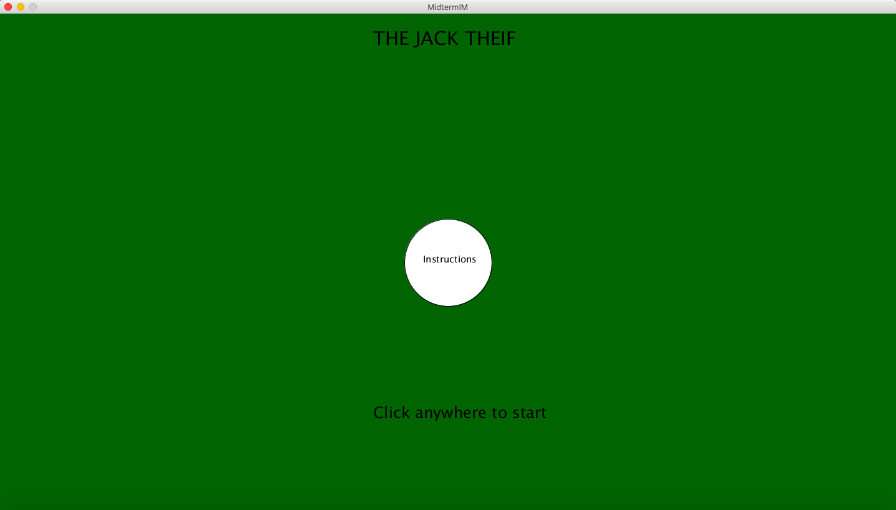
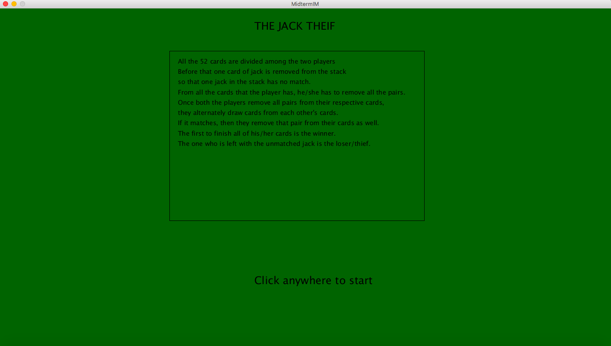
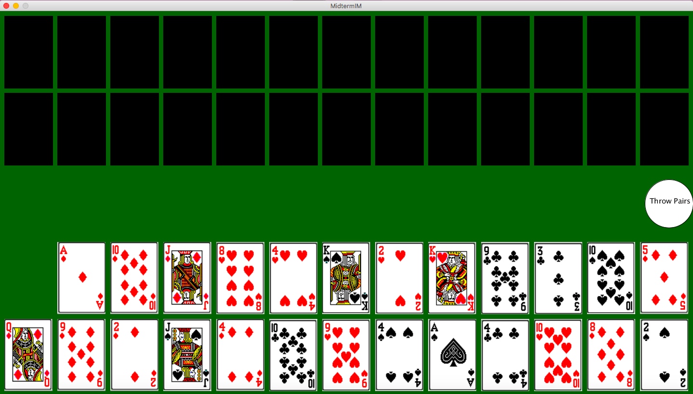
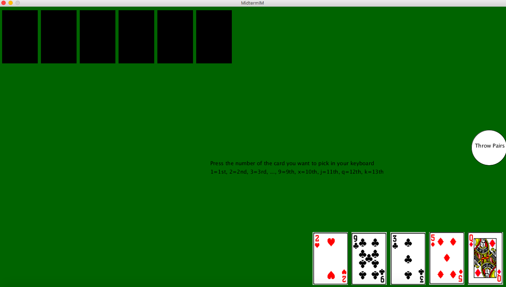
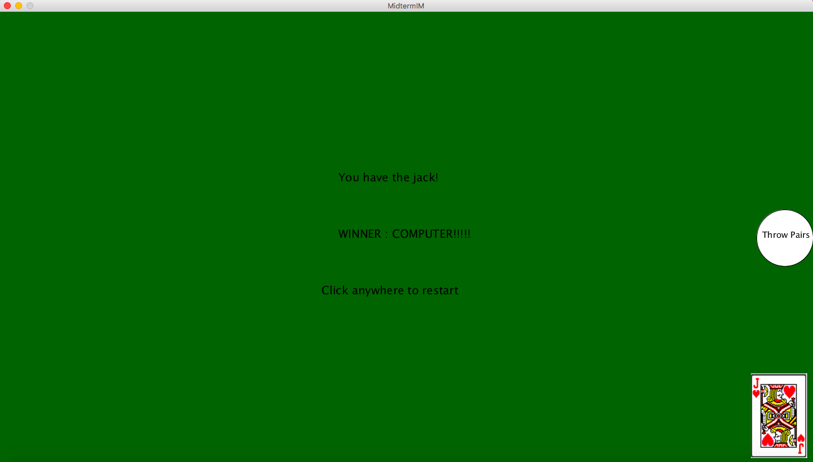

## JUNE 10 MIDTERM

GAME: THE JACK THIEF

### CONCEPT

It is a card game for two players. All the 52 cards are divided among the two players but before that one card of jack is removed from the stack so that one jack in the stack has no match. From all the cards that the player has, he/she has to remove all the pairs. Once both the players remove all pairs from their respective cards, they alternately draw cards from each other's cards. If it matches, then they remove that pair as well. The first to finish all of his/her cards is the winner and the one who is left with the unmatched jack is the loser/thief.

The screenshots of the game are below:

#### HOME PAGE

#### INSTRUCTIONS PAGE

#### BEGINNING OF THE GAME

#### GAME IN PROGRESS

#### END OF GAME

### CHALLENGES

Creating this game in two nights was a huge challenge for me. I had to struggle with alot of logic errors that took me a lot of time to debug. I still have some problem with the sound because when I run the program for the first time it works well but when I try to restart the game without rerunning the program, there are some issues. I doubt that it could be problem with my computer memory but I was not able to figure out what exactly was the problem there. Since there are alot of Card objects in my game, it was difficult for me to plan their positions on screen and how to display them correctly. The other difficulty I faced was with creating classes and defining their attributes and functions, it was very much challenging for me to decide what to put where and how.

### REFLECTION

This project altogether gave a lot of practice with defining classes, creating objects, loading images and playing with the coordinates. It quite got onto my nerves with the logic errors that I kept getting but it was a good experience creating this project. Moreover, the game I created is something I played alot when I was younger. So it also felt nostalgic and reminded me of home.

