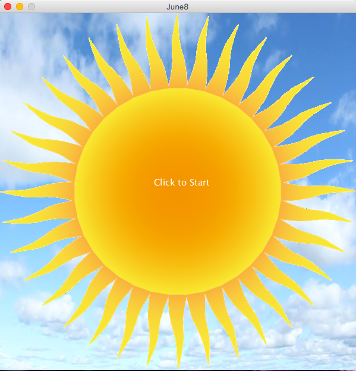
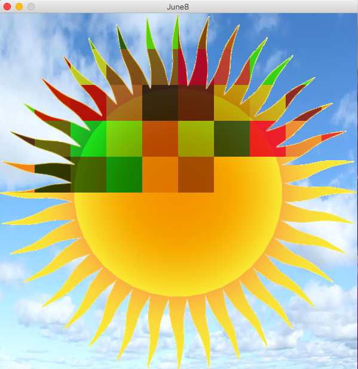
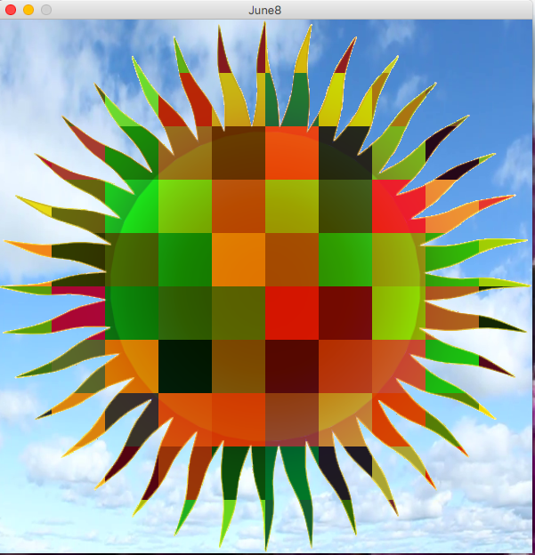
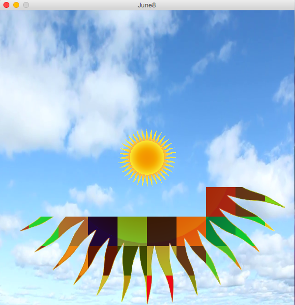

## JUNE 8 ASSIGNMENT
#### IMAGE MANIPULATION

In this assignment I was supposed to manipulate one or more images. So, I chose two images: one for my background and one for the manipulation. What I did in my code is that I loaded the image of sun into the background of sky and then created an animation where it appears as if the sun is divided into small grids and each grid of the sun is changing its color or disappearing. When the code is run, it asks the user to click to start. When the mouse is clicked, the small grids change their colors for two rounds and on the third round, the grids start to disappear and and ultimately the sky and a shrinked sun remain in the background. Screenshots are below:

#### BEGINNING

#### GRIDS CHANGING COLORS

#### WHEN ALL GRIDS HAVE CHANGED COLORS

#### GRIDS ULTIMATELY DISAPPEARING

[Link to Video](https://github.com/ym1929/Introduction-to-Interactive-Media/blob/master/June_8_image_manipulation/Video.mov)

### CHALLENGES

It was challenging for me to implement different effects in different rounds, for example, changing colors, then disappearing and then making the shrinked image appear at the correct time. Figuring out how to change the effects at the right time was something that took me a lot of time and ultimately I made use of a variable countRounds to assign different different effects to different rounds. Also I took me a while to figure out how to make the grids disappear as I was not repainting the background every time the draw() function was running. Finally, I figured out that I could replace the respective grids of the image of the sun with the corresponding image piece of the background image, so that they disappear.

### REFLECTION

This assignment was a good practice with image manipulation although this particular project that I made does not make use of all the Processing functions for image manipulation. I was able to explore different examples and understand them well while deciding what I was going to make for this assignment and trying different kinds of things as shown in the examples.

